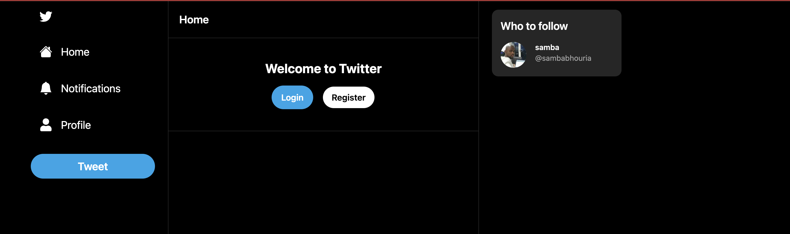
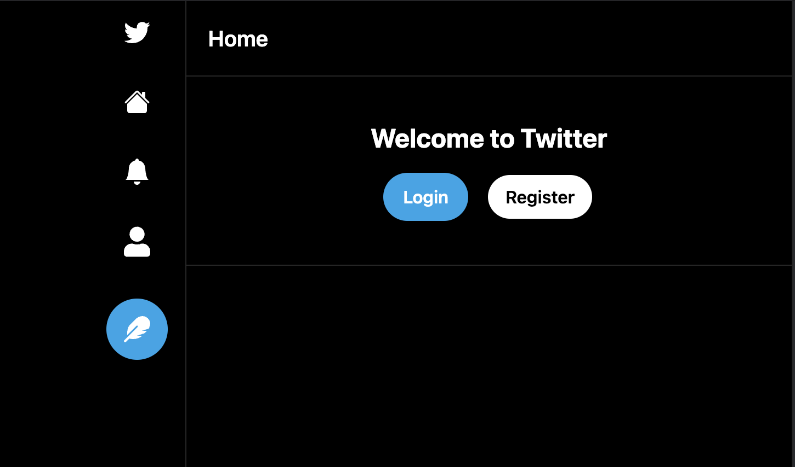
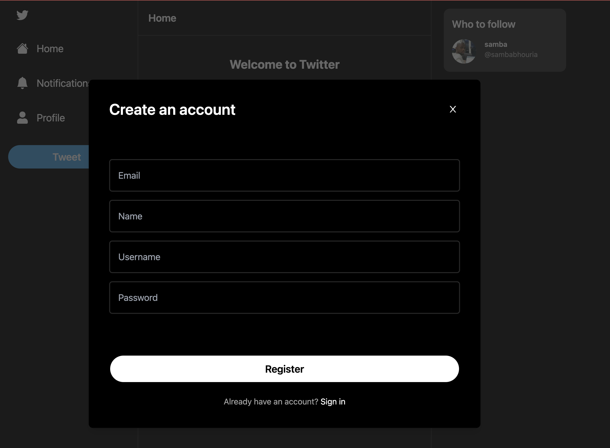
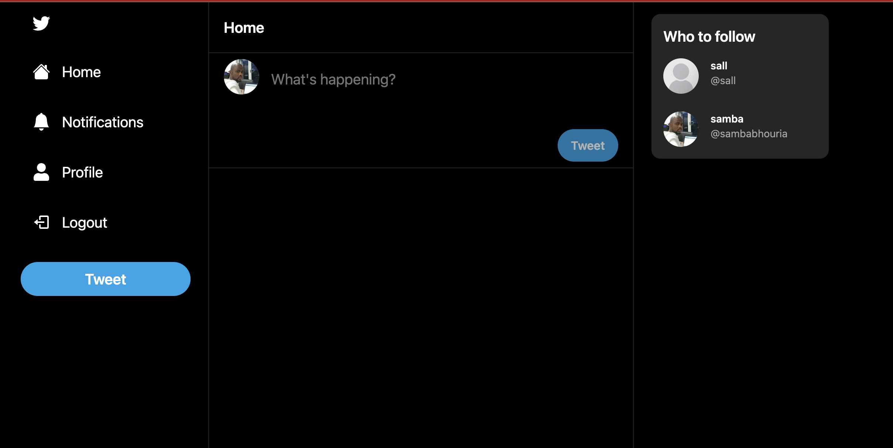
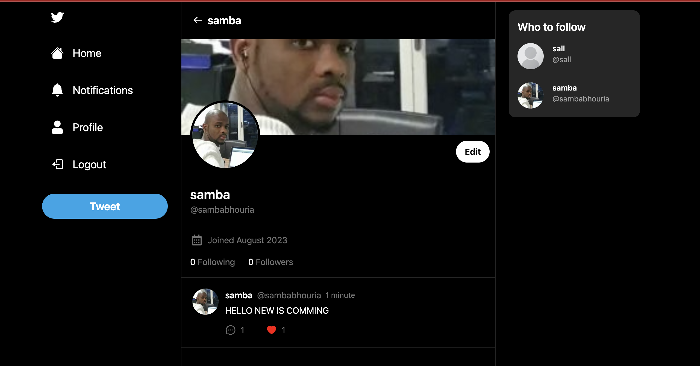

# Build and Deploy: TWITTER clone with React, Tailwind, Next, Prisma, Mongo, NextAuth & Vercel (2023)

This is a repository for a FullStack Twitter clone using React, NextJS, TailwindCSS & Prisma.

# We are going to build funcionalities such as:

Authentication system
Notification system
Image Upload using Base64 strings
Prisma ORM with MongoDB
Responsive Layout
1 To Many Relations (User - Post)
Many To Many Relations (Post - Comment)
Following functionality
Comments / Replies
Likes functionality
Vercel Deployment

🛰️ 🌐 🗄 📡 Technologies
Next 12 (Pages routing)
React
Tailwind
Prisma : npx prisma init
MongoDB

🌐 Prisma intallaiton : 0. npx prisma init
Next steps:

1. Set the "DATABASE_URL" in the .env file to point to your existing database. If your database has no tables yet, read https://pris.ly/d/getting-started
2. Set the provider of the datasource block in schema.prisma to match your database: "postgresql", "mysql", "sqlite", "sqlserver", mongodb or cockroachdb.
3. Run npx prisma db pull to turn your database schema into a Prisma schema.
4. Run npx prisma db push to turn your schema into a database.
   sambadiallo@mamadou ===> src % npx prisma db push
   Environment variables loaded from ../.env
   Prisma schema loaded from prisma/schema.prisma
   Datasource "db": MongoDB database "twitterdb" at "shoeshop.0ybin.mongodb.net"
   Applying the following changes:

[+] Collection `User`
[+] Collection `Post`
[+] Collection `Comment`
[+] Collection `Notification`
[+] Unique index `User_username_key` on ({"username":1})
[+] Unique index `User_email_key` on ({"email":1})

5. Run npx prisma generate to generate the Prisma Client. You can then start querying your database.
   More information in our documentation:
   https://pris.ly/d/getting-started

🔐 Setup .env file
DATABASE_URL=
NEXTAUTH_JWT_SECRET=
NEXTAUTH_SECRET=

💻 Screen Shoo t💻

